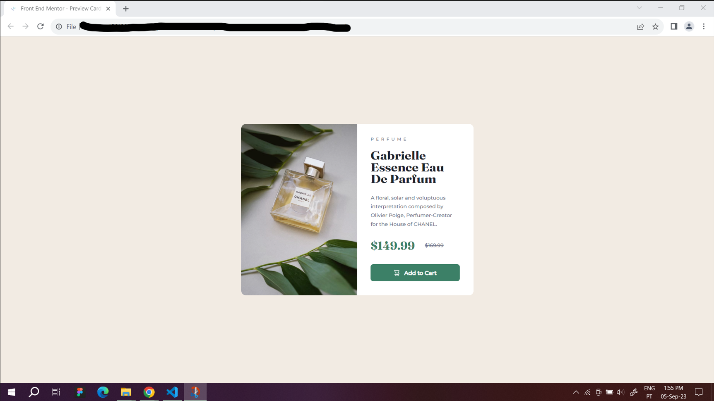
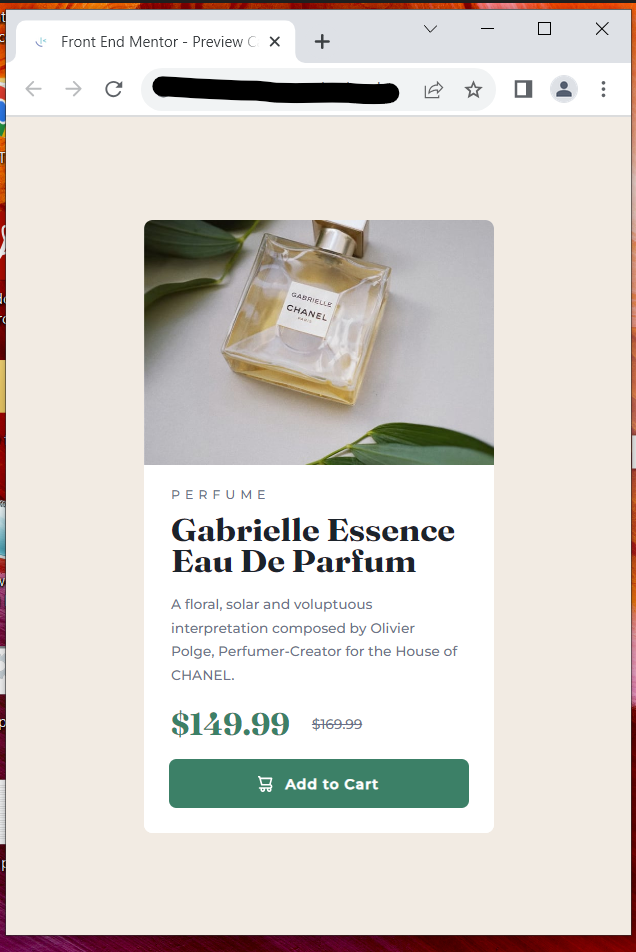

# Frontend Mentor - Product preview card component solution

This is a solution to the [Product preview card component challenge on Frontend Mentor](https://www.frontendmentor.io/challenges/product-preview-card-component-GO7UmttRfa). Frontend Mentor challenges help you improve your coding skills by building realistic projects. 

## Table of contents

- [Overview](#overview)
  - [The challenge](#the-challenge)
  - [Screenshot](#screenshot)
  - [Links](#links)
- [My process](#my-process)
  - [Built with](#built-with)
  - [What I learned](#what-i-learned)
  - [Continued development](#continued-development)
  - [Useful resources](#useful-resources)
- [Author](#author)
- [Acknowledgments](#acknowledgments)

## Overview

### The challenge

Users should be able to:

- View the optimal layout depending on their device's screen size
- See hover and focus states for interactive elements

### Screenshot

### Links

- Solution URL: [Github Repo](https://github.com/Alexandre-Simoes361/Practice/tree/cca0f30e49e8f40dcd52d706f953c47fa1e14d9e/Preview%20Card%20Component)
- Live Site URL: [Add live site URL here](https://your-live-site-url.com)

## My process

### Built with

- Semantic HTML5 markup
- CSS custom properties
- Flexbox

### What I learned

This was the first CSS project I ever built, so it took me lots of looking up the simplest things and even checking out various other people's solutions to understand what options were available to me in terms of building it, because jumping from theory to practice, from my experience with this project, carries this risk, things might be relatively simple to estimate in terms of what it takes to build them, and they might even be easy enough to alter them, but conceptualizing them from the ground up is a daunting task for a first timer. In any case, with some help from a developer with more experience, I got the push I needed and after being able to visualize this "something from nothing", the rest came naturally, and I feel like I walked away with a better understanding of various CSS concepts, not least of which is the flexbox. I also feel like I'll be able to stand on my own two feet that much better for the next one.

### Continued development

If I had to point to my major difficulty with this project, it would have to be getting it to act in a responsive manner, especially with media queries, which I had some trouble getting to work. I would have also preferred to use a <picture> element in my html to handle the change in picture size instead of using the CSS background image workaround, if for nothing else because it would make the project more accessible to anyone using screen readers, but I couldn't get it to work, so that's something I'll wish to work on in the future. I'll also probably experiment with defining some aspects like the background color and font families directly in the :root of the css document, because it seems cleaner, but again, being my first time, I tried to make do as best as I could.

### Useful resources

- [Web Dev CSS](https://web.dev/learn/css/) - This is the resource I refer to the most, highly recommended.

## Author

- Linkedin - [Alexandre Simões](https://www.linkedin.com/in/alexandre-sim%C3%B5es-21198a223/)
- Frontend Mentor - [@Alexandre-Simoes361](https://www.frontendmentor.io/profile/Alexandre-Simoes361)

## Acknowledgments

Thanks to Lazy from Dev PT, he was a huge help to kickstart my understanding of what was being asked of me, and asked for nothing in return. A truly upstanding bloke.
Thanks to Sarah Saballa, checking out your code was definitely a huge help, especially because it made me realize there's more than one way to skin a cat, so to speak, and helped me tremendously in getting the pictures to resize depending on screen dimensions. 
